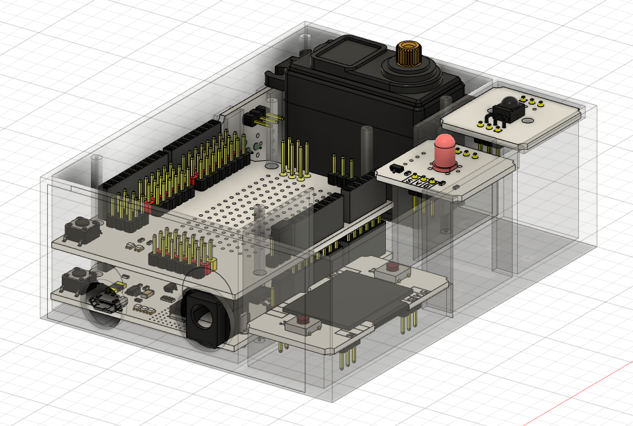

# Smart curtain on IskraJS

Sample code and layouts for 3D printing of smart curtain.

## Features

- Control from any device where there is IR
- No soldering
- Using only troyka components
- Flexible adjustment of the brightness threshold for triggering the script
- Choosing one of two modes:
  - manual
  - auto
  
## Setup
I use the desktop version of the IDE and troyka modules for easy connection. 
To avoid writing '@amperka' every time you import the library and to pair your board with the IDE in detail, follow the
[link](http://wiki.amperka.ru/js:ide). 
Otherwise, do not forget to write the full name of the package, for example, as '@amperka/ir-receiver'. 
 
After preliminary preparation, it is necessary to connect all the necessary components to the board, namely, in my assembly are used:
- [Troyka Shield](https://amperka.ru/product/arduino-troyka-shield)
- [Light sensor](https://amperka.ru/product/troyka-light-sensor)
- LED
  - [Piranha LED](https://amperka.ru/product/troyka-led-module)
    or
  - [5mm LED](https://amperka.ru/product/troyka-5mm-led-module)
- [IR-receiver](https://amperka.ru/product/troyka-ir-receiver)
- [Power cell](https://amperka.ru/product/troyka-power-cell)
- [Servo](https://amperka.ru/product/servo-fs5113r)

After all the components are installed, you need to connect the IskraJS board to your computer and upload the code from the file there [index.js](https://github.com/Baga9898/smart-curtain-iskraJS/blob/main/index.js).

## Customization
Assign values to constants corresponding to your ports:

    const ir          = require('ir-receiver').connect(P0);
    const light       = require('led').connect(P1);
    const lightSensor = require('light-sensor').connect(A0);
    const servo       = require('servo').connect(P8);  

Next comes the assignment of the IR device buttons.
You can output the code of the button you pressed to the console on the reception event on the IR receiver, thanks to which you can control from where it is convenient.

    const bottomButton  = 378124359;
    const topButton     = 378101919;
    const modeButtonOff = 378126399;
    const modeButtonOn  = 378077439;
    const stopButton    = 378091719;

Further along are the constants responsible for the states of the servo.

    const speedMaxCW  = 544;
    const speedMaxCCW = 2400;
    const speedStop   = (speedMaxCW + speedMaxCCW) / 2;

in PDM servos of constant rotation, the speed of rotation of the shaft depends on the pulse length. 
For more information, [take a look](http://wiki.amperka.ru/articles:servo-pdm-continuous-rotation).

    const maxBright = 5000;

There is also a constant maxBright, which is responsible for the brightness threshold, exceeding which in automatic mode the servo will work and the curtain will go down. 
Change these values depending on your conditions or lighting preferences.

## Up & Down
Two more important settings are the time of lowering and raising the curtains in automatic mode, intervals are responsible for them.

There is a basic interval responsible for how often the brightness value will be read, it should be greater than the value after how long the servo stops.

    setInterval(() => {
        let luxes = lightSensor.read('lx').toFixed(0);
        handleLuxesCheck(luxes);
    }, 60000); // Checking the brightness level every minute.

Adjust the millesecond value in the servo stop function, taking into account how much is needed for the full descent/lifting of your curtain, but it should not exceed the values in the main interval.

    const servoStop = () => {
        setTimeout(() => {
            setServoValue(speedStop);
        }, 14500); // Stop rotation after 14.5 seconds.
    };

## Other
[TODO](TODO.md) 
[CHANGELOG](CHANGELOG.md)

Do good. 
=)=)